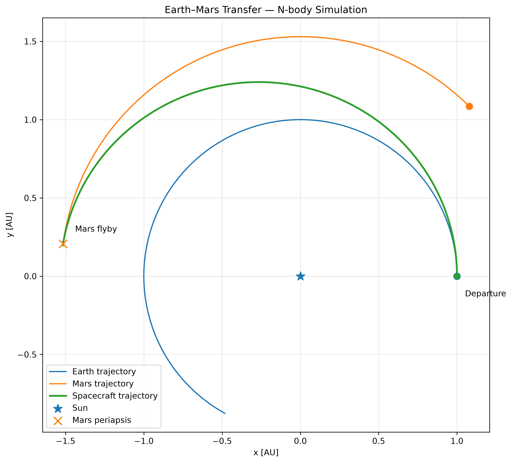
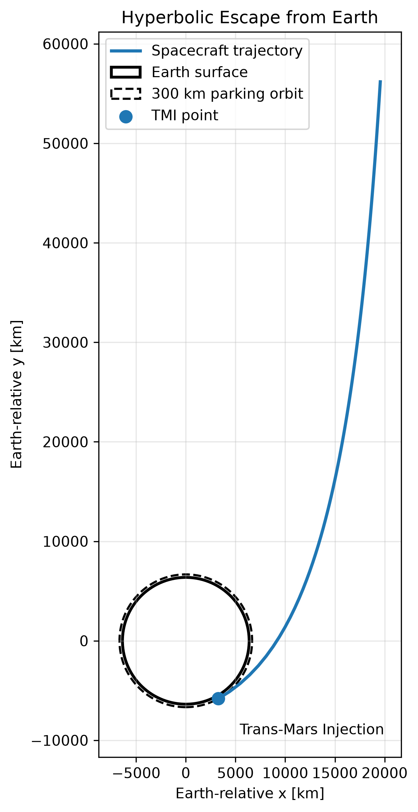
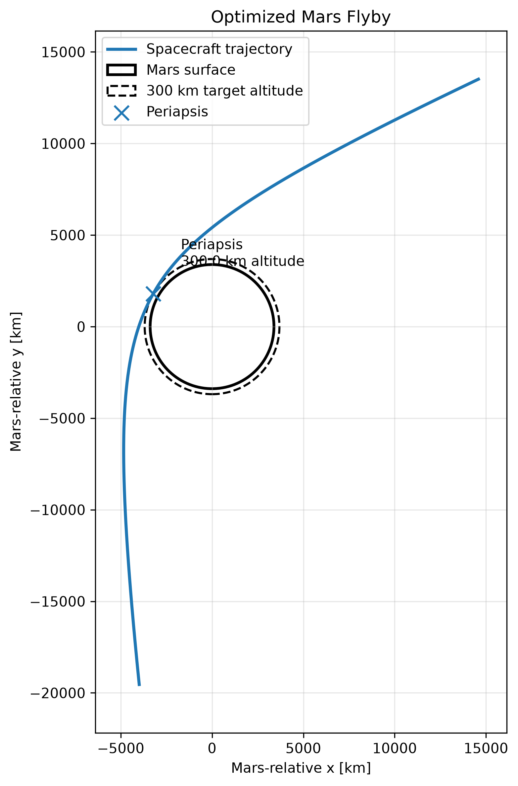
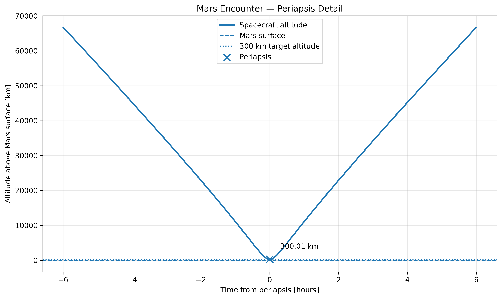
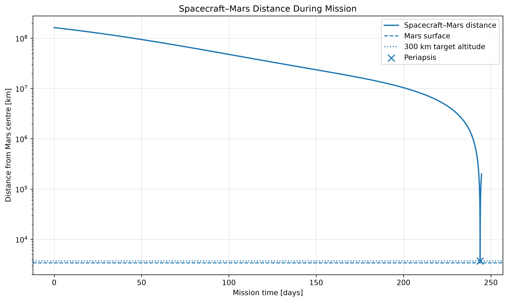

# Earth–Mars N-Body Trajectory Simulation

A computational physics project modelling an idealized Earth-to-Mars transfer using Newtonian N-body dynamics, Velocity Verlet integration, analytical Hohmann-transfer estimates, hyperbolic Earth escape, convergence analysis and numerical trajectory optimization.

The project began as a first-year Physics orbital simulation and was later rebuilt into a modular and numerically validated astrodynamics project.

---

## Final result

The final simulation models a spacecraft departing from a **300 km Earth parking orbit**, performing an idealized Trans-Mars Injection (TMI), escaping Earth on a hyperbolic trajectory, propagating through the Sun–Earth–Mars gravitational system and performing a targeted Mars flyby.

| Quantity | Result |
| --- | ---: |
| Earth parking orbit altitude | 300 km |
| TMI delta-v | 3.599 km/s |
| Analytical Hohmann Mars phase | 44.677° |
| Optimized N-body Mars phase | 45.197° |
| Phase correction | +0.520° |
| Mars periapsis altitude | 300.006 km |
| Closest approach time | 243.878 days |
| Relative speed at Mars periapsis | 5.543 km/s |

The final trajectory is a **Mars flyby**, not an orbital insertion. No Mars capture burn is modelled.



---

## Simulation workflow

The project combines analytical orbital mechanics with numerical propagation:

```text
Analytical Hohmann transfer
          ↓
300 km Earth parking orbit
          ↓
Trans-Mars Injection
          ↓
Hyperbolic Earth escape
          ↓
N-body heliocentric propagation
          ↓
Mars phase optimization
          ↓
300 km Mars flyby
```

The Hohmann solution provides the analytical starting point. The complete N-body trajectory is then numerically propagated and the initial Mars phase is refined until the target flyby geometry is obtained.

---

## Hyperbolic Earth escape



The spacecraft begins in a circular **300 km Earth parking orbit**.

The required heliocentric Hohmann excess velocity is converted into an Earth-relative hyperbolic departure using a patched-conic approximation.

The departure hyperbola is oriented so that its outgoing asymptotic velocity is approximately aligned with Earth's prograde heliocentric motion.

For the modelled parking orbit:

```text
Parking-orbit speed:       7.731 km/s
Hyperbolic excess speed:   2.972 km/s
Injection speed:          11.329 km/s
TMI delta-v:               3.599 km/s
```

---

## Optimized Mars flyby



The analytical Hohmann phase angle is:

$$
\phi_H = 44.677^\circ
$$

The N-body model required a slightly different initial Mars phase:

$$
\phi_{\mathrm{opt}} = 45.19697^\circ
$$

giving:

$$
\Delta \phi \approx 0.520^\circ
$$

The phase was refined numerically while rejecting trajectories that intersected the physical radius assigned to Mars.

The accepted trajectory produced a nominal periapsis altitude of:

$$
h_p \approx 300.006\ \mathrm{km}
$$

with a relative spacecraft–Mars speed of approximately:

$$
v_{\mathrm{rel}} \approx 5.543\ \mathrm{km/s}
$$

The metre-scale difference from the 300 km numerical target should **not** be interpreted as metre-scale physical accuracy. It is only the optimized result within the simplified numerical model.

---

## Mars encounter detail



The close-encounter integration resolves the trajectory around periapsis using a much smaller time step than during interplanetary cruise.

---

## Spacecraft–Mars distance



The logarithmic scale shows the spacecraft–Mars separation decreasing from interplanetary distances of order $10^8$ km to only a few thousand kilometres from the centre of Mars.

---

# Physics model

The simulation uses Newtonian gravitational dynamics.

For body $i$, the gravitational acceleration generated by the other massive bodies is:

$$
\mathbf{a}_i
=
G
\sum_{j \ne i}
m_j
\frac{
\mathbf{r}_j-\mathbf{r}_i
}{
\left|\mathbf{r}_j-\mathbf{r}_i\right|^3
}
$$

The model uses astronomical units, years and solar masses, giving:

$$
G = 4\pi^2
$$

in the corresponding unit system.

The spacecraft is modelled as a **massless test particle**: it responds to the gravitational field of the other bodies but does not perturb them.

The dynamics are two-dimensional and coplanar.

---

# Numerical integration

The equations of motion are propagated using **Velocity Verlet**.

Positions are updated as:

$$
\mathbf{r}_{n+1}
=
\mathbf{r}_n
+
\mathbf{v}_n \Delta t
+
\frac{1}{2}
\mathbf{a}_n
\Delta t^2
$$

After evaluating the new acceleration $\mathbf{a}_{n+1}$, velocities are updated as:

$$
\mathbf{v}_{n+1}
=
\mathbf{v}_n
+
\frac{1}{2}
\left(
\mathbf{a}_n
+
\mathbf{a}_{n+1}
\right)
\Delta t
$$

Velocity Verlet was selected because it is a second-order method well suited to orbital dynamics.

---

# Numerical validation

The trajectory was not accepted solely because it looked plausible. Several convergence studies were performed.

## Barycentric Earth–Sun orbit

A circular two-body system was propagated with progressively smaller time steps.

The observed position-error convergence order was approximately:

$$
p \approx 2
$$

consistent with the theoretical second-order behaviour of Velocity Verlet.

Total mechanical energy was also monitored during the simulation.

## Earth escape convergence

The first five days of the hyperbolic Earth departure were propagated using progressively smaller time steps.

Halving the time step reduced the differences in position and velocity by approximately a factor of four, again demonstrating second-order convergence.

## Interplanetary cruise convergence

After resolving the Earth escape with a small time step, cruise propagation using approximately **63.1 s** and **31.6 s** steps was compared.

The difference in closest-approach distance was only approximately:

$$
0.04\ \mathrm{km}
$$

for the tested trajectory.

This showed that the interplanetary part of the trajectory can be integrated using a significantly larger time step without materially changing the result.

## Mars encounter convergence

The close Mars flyby was independently tested using approximately:

- 3.94 s
- 1.97 s
- 0.99 s

time steps.

The computed periapsis altitude changed only by a few metres across these resolutions.

---

# Multi-timescale propagation

The final mission uses different fixed time steps for different dynamical regimes:

| Mission phase | Approximate time step |
| --- | ---: |
| Earth escape | 3.94 s |
| Interplanetary cruise | 63.1 s |
| Close Mars encounter | 3.94 s |

Near Earth and Mars, gravitational acceleration changes rapidly and requires higher temporal resolution.

During the smoother heliocentric cruise, a larger time step substantially reduces computation time while preserving the trajectory to the required numerical accuracy.

This is a prescribed **multi-timescale scheme**, rather than an error-controlled adaptive integrator.

---

# Hohmann analytical reference

For departure radius $r_1$ and arrival radius $r_2$, the Hohmann transfer semi-major axis is:

$$
a_t
=
\frac{r_1+r_2}{2}
$$

The heliocentric departure speed is obtained from the vis-viva equation:

$$
v_H
=
\sqrt{
\mu
\left(
\frac{2}{r_1}
-
\frac{1}{a_t}
\right)
}
$$

The analytical transfer time is:

$$
t_H
=
\pi
\sqrt{
\frac{a_t^3}{\mu}
}
$$

which gives approximately **260 days** for the simplified Earth–Mars configuration used here.

The analytical solution provides a benchmark and initial-condition estimate rather than the final optimized trajectory.

---

# Trans-Mars Injection

The heliocentric Hohmann departure speed is converted into an Earth-relative hyperbolic excess velocity:

$$
v_\infty
=
v_H-v_E
$$

For parking-orbit periapsis radius $r_p$, the required hyperbolic periapsis speed is:

$$
v_p
=
\sqrt{
v_\infty^2
+
\frac{2\mu_E}{r_p}
}
$$

The idealized impulsive Trans-Mars Injection is then:

$$
\Delta v_{\mathrm{TMI}}
=
v_p-v_{\mathrm{parking}}
$$

giving approximately:

$$
\Delta v_{\mathrm{TMI}}
\approx
3.60\ \mathrm{km/s}
$$

for the modelled 300 km parking orbit.

---

# Project structure

```text
.
├── bodies.py
├── physics.py
├── integrators.py
│
├── final_trajectory.py
├── plot_final_trajectory.py
├── animate_trajectory.py
│
├── tests/
├── experiments/
├── legacy/
│
├── results/
│   ├── final_trajectory.csv
│   └── plots/
│
├── requirements.txt
└── README.md
```

## Core modules

### `bodies.py`

Defines the physical-body representation used by the simulation.

### `physics.py`

Contains Newtonian gravity, energy calculations, circular-orbit relations, Hohmann-transfer functions and hyperbolic-escape calculations.

### `integrators.py`

Implements the Velocity Verlet integration step.

---

## Final pipeline

### `final_trajectory.py`

Runs the optimized mission and exports sampled states to:

```text
results/final_trajectory.csv
```

### `plot_final_trajectory.py`

Reads the saved trajectory and generates the final scientific figures.

### `animate_trajectory.py`

Creates an interpolated animation of the complete heliocentric transfer.

---

## Development and validation

`tests/` contains numerical convergence and validation scripts.

`experiments/` preserves intermediate Hohmann, N-body, phase-search and flyby-optimization models.

`legacy/` contains the original first-year VPython/Tkinter simulation and historical outputs.

---

# Quick start

Tested locally with **Python 3.11.9**.

From the repository root, create a virtual environment:

```powershell
python -m venv .venv
```

Install the dependencies on Windows:

```powershell
.\.venv\Scripts\python.exe -m pip install -r requirements.txt
```

Generate the final trajectory:

```powershell
.\.venv\Scripts\python.exe final_trajectory.py
```

Generate the figures:

```powershell
.\.venv\Scripts\python.exe plot_final_trajectory.py
```

Run the animation:

```powershell
.\.venv\Scripts\python.exe animate_trajectory.py
```

If the virtual environment is already active, the shorter commands also work:

```powershell
python final_trajectory.py
python plot_final_trajectory.py
python animate_trajectory.py
```

On macOS/Linux, use:

```bash
.venv/bin/python
```

instead of the Windows interpreter path.

The final simulation can take several minutes.

---

# Numerical diagnostics

Run validation modules **from the repository root**:

```powershell
python -m tests.test_earth_orbit
python -m tests.test_time_step_convergence
python -m tests.test_barycentric_convergence
python -m tests.test_escape_convergence
python -m tests.test_hybrid_timestep
python -m tests.test_transfer_timestep
python -m tests.test_mars_encounter_convergence
python -m tests.final_phase_validation
```

These scripts are numerical diagnostics rather than assertion-based `pytest` unit tests.

Their printed convergence results must be interpreted rather than treating a successful program exit alone as evidence of numerical correctness.

Some convergence studies can take several minutes.

See [`tests/VERIFICATION.md`](tests/VERIFICATION.md) for additional verification notes.

---

# Animation

Run:

```powershell
python animate_trajectory.py
```

to display the complete heliocentric transfer.

The animation interpolates the stored trajectory onto uniformly spaced mission times for visualization.

It does **not** alter or rerun the underlying numerical integration.

To export a GIF, set:

```python
SAVE_GIF = True
```

inside `animate_trajectory.py`.

The exported animation is intended as a visual overview of the mission, not as a high-resolution periapsis diagnostic.

---

# Experimental models

The `experiments/` directory preserves intermediate models used during development, including:

- the analytical Hohmann-transfer model;
- the first full N-body Earth–Mars propagation;
- Mars phase-angle searches;
- hybrid time-step optimization;
- collision-aware flyby searches;
- and final phase refinement.

These scripts document the development process but are not required to run the final mission pipeline.

---

# Legacy project

The original interactive VPython/Tkinter simulation is preserved in `legacy/` for provenance.

Its assumptions and trajectory-adjustment logic differ substantially from the current N-body model.

See:

[`legacy/README-original.md`](legacy/README-original.md)

for the original project documentation.

The legacy implementation is not required by the final simulation.

---

# Reproducibility

`requirements.txt` contains the direct Python dependencies used by the current project.

The final trajectory is exported to:

```text
results/final_trajectory.csv
```

and the scientific figures are generated under:

```text
results/plots/
```

The trajectory CSV is sampled at different rates during Earth escape, heliocentric cruise and the Mars encounter.

The animation therefore interpolates the saved trajectory onto uniformly spaced mission times before displaying it.

---

# Limitations

This is a computational-physics and numerical-methods project, **not a high-fidelity mission-design tool**.

Main simplifications include:

- two-dimensional coplanar dynamics;
- simplified initially circular planetary states;
- no real planetary ephemerides;
- massless spacecraft;
- idealized impulsive Trans-Mars Injection;
- no finite-duration propulsion;
- no atmospheric effects;
- no Mars orbital insertion or capture;
- no orbital inclination;
- no additional Solar System bodies;
- no relativistic corrections.

The optimized phase angle and flyby parameters should therefore be interpreted as results **within this model**, not as operational mission-design values.

---

# Possible extensions

Potential future extensions include:

- real planetary ephemerides;
- three-dimensional orbital dynamics;
- adaptive time stepping;
- launch-window optimization;
- optimization of departure velocity and direction;
- Mars orbital insertion;
- additional planetary perturbations;
- higher-performance N-body propagation;
- comparison with professional astrodynamics software.

---

# Project origins

The original version of this project was developed during the first year of a Physics degree as a simple interactive orbital simulation.

It was later rebuilt to investigate how analytical orbital mechanics, N-body propagation, numerical integration, convergence analysis, constrained trajectory optimization and scientific visualization can be combined into a reproducible computational-physics workflow.

The original VPython/Tkinter implementation is preserved in [`legacy/`](legacy/) for provenance.
